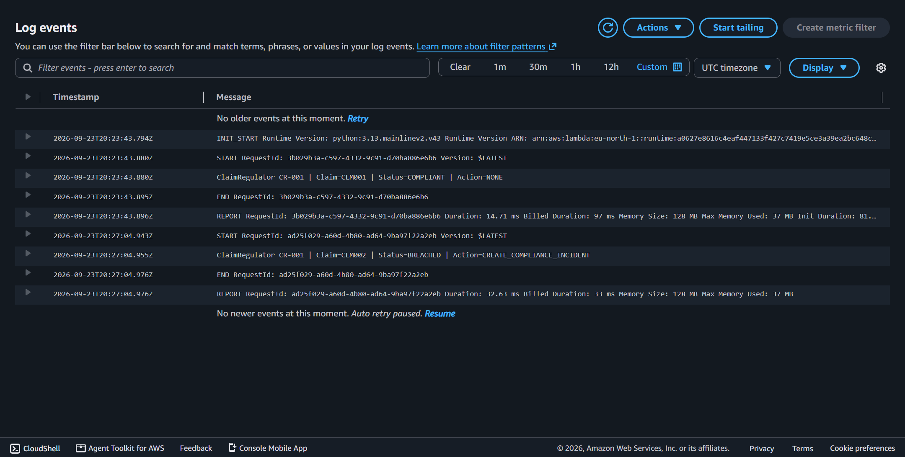

# Claim_Regulator
Cloud-based insurance claims compliance monitoring system designed to support compliant, timely and auditable claims processing.

### Cloud Execution Evidence

The following CloudWatch logs show CR-001 processing both a compliant and breached synthetic claim:

